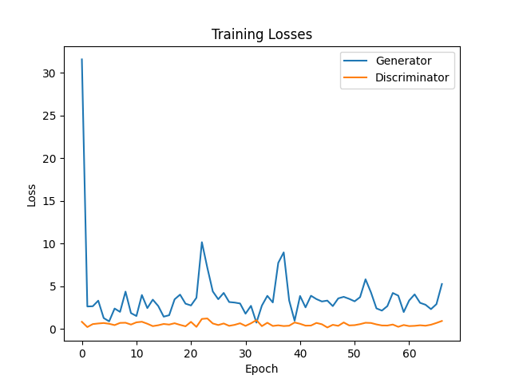

# DCGAN
> In this repository, I tried to use [`PyTorch`](https://pytorch.org/) library and implement a simple project to generate random frontal face images.

## Introduction
Welcome to `DCGAN` repository!
This Python script defines and trains a deep convolutional neural network using `PyTorch` to generate `random face images` just using a vector of random numbers between `0` and `1` as an input of model (Length of the vector is adjustable). DCGAN stands for Deep Convolutional Generative Adversarial Network. 
Whether you are interested in the fundamentals of `image generation` or seeking `hands-on exploration`, this repository provides an opportunity to delve into `GANs`. To get started, follow the `usage instructions` and explore the `scripts` located in the `./src` folder. Happy exploring and creating!

## Usage
To use this `DCGAN` repository, follow these steps:
1. Clone the repository:
```bash
git clone https://github.com/mhrnbzrafkn/DCGAN
cd DCGAN
```
2. Install the required dependencies:
```bash
pip install -r requirements.txt
```
3. Execute the Python script inside the `./src` folder to train the model and generate images:
```bash
python ./src/run.py
```
Make sure to customize the paths and parameters according to your dataset and preferences within the script before running it. Happy generating!

## Project Structure
-   `./src`: Main folder.
    -   `./src/run.py`: Main Python file for training the `DCGAN` model and generating images.
    -   `./src/generator_API.py`: Simple API project to utilize a trained `DCGAN` model for generating new face images.
    -   `./src/test_trained_model.py`: Simple Python script to utilize a trained `DCGAN` model for generating new face images.
-   `./src/training-src`: This folder contains all the data needed for training the model and the outputs of the training process.
    -   `./src/training-src/training_images`: Folder containing the training images used for training the DCGAN model. (Images should be organized in a subfolder like `faces`.)
    -   `./src/training-src/output_results`: Folder containing all the output generated during the training process, including generated images for each epoch, the training report, and the main models.

## Demo
<p align="center">
  
  
</p>

## Dependencies
- [](https://pytorch.org/)
- [](https://matplotlib.org/)
- [](https://numpy.org/)

## Contributing
We welcome contributions! Please [Contact Me](https://www.linkedin.com/in/mehran-bazrafkan/) before making a pull request or raising issues.